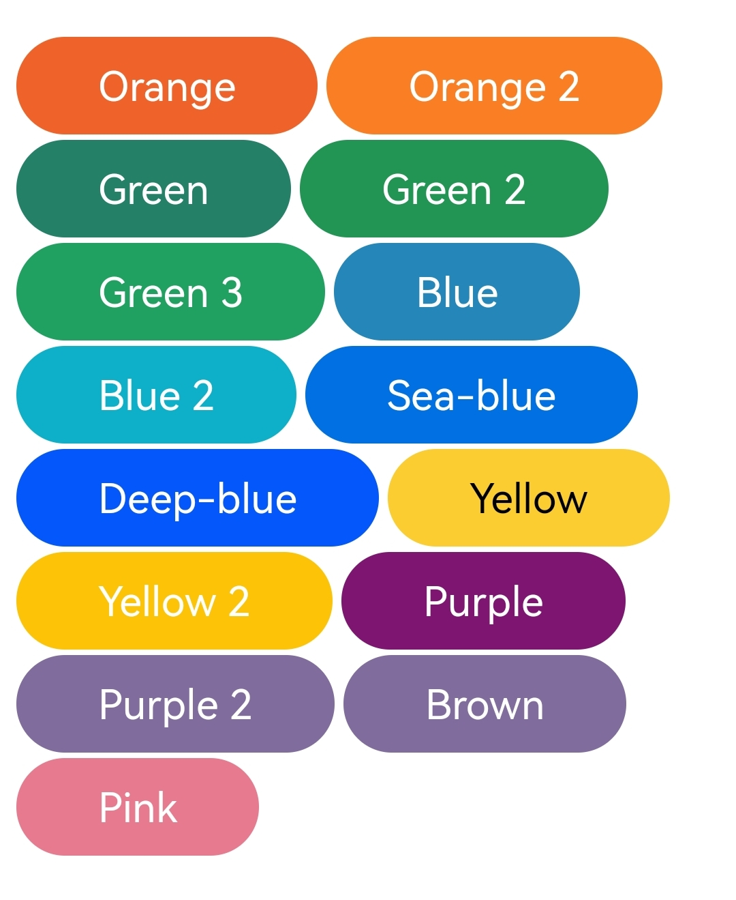
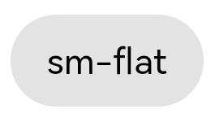
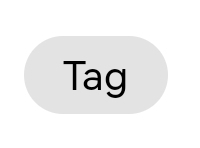

# Cobu

Cobu 是一个按钮CSS样式，可以快速调用使用，并具有丰富的自定义选项。

# 如何使用？
## 本地文件
下载所有的文件并解压，也许你可以运行**example.html**，查看各种样式。

别忘了引入CSS文件，就像这样:

```html
<link rel="stylesheet" href="style.css">
```
## JsDelivr
使用JsDelivr，能够减少项目大小，也能快速使用，无需下载：

```html
<linl rel="stylesheet" href="https://fastly.jsdelivr.net/gh/overraystyle/Cobu@latest/style.css">
```

# 颜色
我们预设了一些颜色，你可以看看下面的图片：



比如说：

```html
<button class="flat radius block blue">Button</button>
```


这样你就得到了一个**蓝色的扁平圆圆的Block按钮**


# 按钮样式
Cobu提供了非常多的预设定按钮样式，你可以通过我们提供的example.html文件来查看，或者直接上手试一试吧！

|类名|样式说明|
|----|----|
| / |无需类名，生成一个简单的按钮样式|
|`border`|恢复原始的按钮样式，但保留简单的按钮样式|
|`square`|长方形的按钮|
|`less-padding`|更少的左右边距|
|`no-padding`|没有左右边距|
|`flat`|扁平的按钮|
|`radius`|圆圆的按钮|
|`circle`|非常圆的按钮，字体非常大|
|`icon`|适合图标的按钮|
|`sm`|默认小尺寸的按钮|
|`md`|默认中尺寸的按钮|
|`lg`|默认大尺寸的按钮|
|`block`|默认的Block按钮|
|`full-block`|铺满屏幕宽度的Block按钮|

请注意！Cobu的最好玩的地方是可以任意组合！就像是你想制作一个**扁平圆圆的block按钮**，就像这样：

```html
<button class="flat radius block">Button</button>
```


看，就像一个句子一样，非常简单。而且类名也简单易懂！

# 预设定样式
自**v1.0.1**开始，我们预设了两种按钮样式，未来会添加更多样式：
|样式类名|样式图|样式说明|
|----|----|----|
|sm-flat||小字体的肥胖按钮|
|tag||标签按钮|

# Hover
Cobu也支持Hover样式，只需要添加一个Hover类名即可
```html
<button class="hover">Hover</button>
```
添加颜色:
```html
<button class="hover orange">Hover</button><br>
```
直接添加颜色即可。

# 自定义选项
Cobu提供了一个自定义选项，如果你需要使用自定义的话，引入quicker.js文件即可
```html
<linl rel="stylesheet" href="https://cdn.jsdelivr.net/gh/overraystyle/Cobu@latest/quicker.js">
```

> quicker.js仍在测试阶段，若出现任何问题，请停止使用quicker.js，谢谢！

## 按钮颜色
> 参数：`color`
> 说明：可自定义按钮的颜色
> 不支持类型：hover
> 版本：1.0

使用示例：
```html
<button class="radius" color="red">Button</button>
```

## hover 按钮颜色
> 参数：`hover`
> 说明：可自定义`hover`类型的按钮颜色
> 不支持类型：仅支持hover
> 版本：1.0.1

使用示例：
```html
<button class="hover" hover="red">Button</button>
```

## 按钮字体大小
> 参数：`font`
> 说明：可自定义按钮字体大小
> 不支持类型：none
> 版本：1.0

使用示例：
```html
<button class="radius" font="3em">Button</button>
```

## 按钮左右边距大小
> 参数：`lr`
> 说明：同时调整按钮左右边距
> 不支持类型：none
> 版本：1.0

使用示例：
```html
<button class="radius" lr="10px">Button</button>
```

## 按钮上下边距大小
> 参数：`ud`
> 说明：同时调整按钮的上下边距大小
> 不支持类型：none
> 版本：1.0

使用示例：
```html
<button class="radius" ud="10px">Button</button>
```

## 按钮圆角度
> 参数：`radius`
> 说明：调整按钮的radius度
> 不支持类型：`radius`
> 版本：1.0

```html
<button radius="10px">Button</button>
```

# Cobu的好处
Cobu可以用很少的样式就可以达到其他插件的效果，这是非常方便的。

最后，感谢你使用Cobu，如果使用期间有什么问题或有什么建议，欢迎提交Issue，我们还尽快回复你的！
