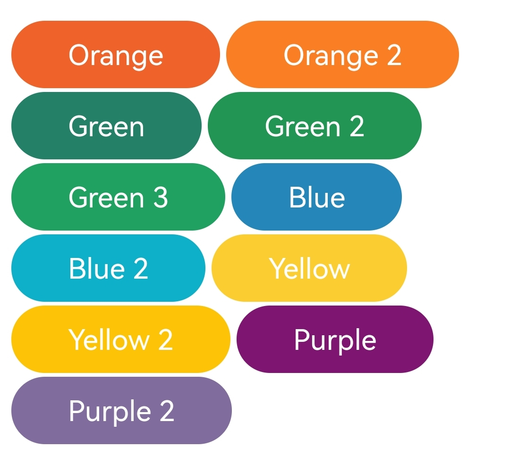

# Cobu
[English](README.md)

Cobu 是一个按钮CSS样式，可以快速调用使用，并具有丰富的自定义选项。

# 如何使用？
下载所有的文件并解压，也许你可以运行**example.html**，查看各种样式。

别忘了引入CSS文件，就像这样:

```html
<link rel="stylesheet" href="style.css">
```

# 按钮样式
Cobu提供了非常多的预设定按钮样式，你可以通过我们提供的example.html文件来查看，或者直接上手试一试吧！

|类名|样式说明|
|----|----|
| / |无需类名，生成一个简单的按钮样式|
|`border`|恢复原始的按钮样式，但保留简单的按钮样式|
|`square`|长方形的按钮|
|`less-padding`|更少的左右边距|
|`no-padding`|没有左右边距|
|`flat`|扁平的按钮|
|`radius`|圆圆的按钮|
|`circle`|非常圆的按钮，字体非常大|
|`icon`|适合图标的按钮|
|`sm`|默认小尺寸的按钮|
|`md`|默认中尺寸的按钮|
|`lg`|默认大尺寸的按钮|
|`block`|默认的Block按钮|
|`full-blocl`|铺满屏幕宽度的Block按钮|

请注意！Cobu的最好玩的地方是可以任意组合！就像是你想制作一个**扁平圆圆的block按钮**，就像这样：

```html
<button class="flat radius block">Button</button>
```

看，就像一个句子一样，非常简单。而且类名也简单易懂！

# 颜色样式
我们预设了一些样式，你可以通过两种方式获取颜色。

## 直接通过类名
我们预设了一些颜色，你可以看看下面的图片：




比如说：

```html
<button class="flat radius block blue">Button</button>
```

这样你就得到了一个**蓝色的扁平圆圆的Block按钮**

## 自定义

Cobu的包体内包含了一个JavaScript文件，这也是AbundantCSS的特殊点之一，我们称他为**Quicker**，只需要像这样，你就可以自定义颜色了：

**请注意，该自定义起初是给已经引入其他框架的开发者提供的，如果该框架会导致按钮样式失效或错乱，开发者可以通过这个方式开恢复按钮样式**

**Quicker.js仍在测试阶段，如果有出现任何错误，请停止使用！**

引入Quicker.js文件：

```html
<script src="quicker.js">
```

尝试快速自定义你的按钮颜色：

```html
<button class="flat" color="black">Button</button>
```

这样你会获得一个黑色的按钮！

如果你要自定义文字颜色的话，也非常简单，就像这样：

```html
<button class="flat" text="white">Button</button>
```

按钮的颜色就变成白色了！

# 自定义按钮
我们预设定了三个大小，如果你觉得不满意，你可以引入Quicker.js来自定义大小

首先按照上面说的一样，引入Quicker.js......

## 按钮字体大小
```html
<button class="radius" font="3em">Button</button>
```
## 按钮左右边距大小
> 为了美观，左右边距必须一致

> lr是left and right的缩写
```html
<button class="radius" lr="10px">Button</button>
```

## 按钮上下边距大小
> 就像上面说的一样，为了美观！

> ud是up and down的缩写

```html
<button class="radius" ud="10px">Button</button>
```

## 按钮圆角度

> 如果你使用了`radius`类名，这个设置可能会失效！

```html
<button radius="10px">Button</button>
```

# Cobu的好处
Cobu可以用很少的样式就可以达到其他插件的效果，这是非常方便的。在未来，**我们会更新一个类似于套装的类名**，仅需使用一个套装类名就可以达到不同的按钮样式。

最后，感谢你使用Cobu，如果使用期间有什么问题或有什么建议，欢迎提交Issue，我们还尽快回复你的！
